# Architecture

- Status: accepted design baseline
- Date: 2026-07-22
- Scope: local-first foundation and staged V0

## Executive summary

Noema combines a derived-knowledge pipeline with an event-driven agent runtime.
It does not repeat provider capture, parsing, or canonical transcript storage
already owned by Sessions. It consumes canonical evidence, extracts observable
facts deterministically, admits evidence-backed semantic claims, and stores the
derived records and provenance that its agents need.

The event pipeline records meaningful changes, enqueues subscribed agents, and
stores their typed outputs. Events trigger agents; they do not carry all of the
evidence an agent may need. Agents use evidence references to retrieve bounded
context from the knowledge layer.

The first implementation is a standalone Go application with a Noema-owned
SQLite database. Sessions is the first evidence plane. Content Scout is the
first agent. One explicitly selected session is processed through independently
inspectable milestones before broader scans are considered. A manual producer
followed by a one-shot worker remains the first complete execution mode.

## Design influences

Noema draws from two public designs:

- Drew Bredvick's event-driven agent pattern: build a normalized evidence
  layer, express meaningful changes as events, publish them to a queue, and let
  small focused agents subscribe.
- Cerebras's knowledge-base design: meet data where it lives, distill
  coherent source units into a shared shape, retain rich metadata and
  provenance, combine retrieval methods, restore useful context, and give
  agents narrow evidence tools.

References:

- <https://x.com/dbredvick/status/2077938167567487241>
- <https://x.com/dbredvick/status/2078086524470464577>
- <https://x.com/dbredvick/status/2078108962319217145>
- <https://x.com/dbredvick/status/2078150905078206789>
- <https://www.cerebras.ai/blog/how-we-built-our-knowledge-base>

These are influences, not specifications. Noema adapts them for private,
personal-scale work and explicit human control.

The first two X threads supply the event-driven thesis and concrete sequence.
The third uses “ontology” for the shared normalized model; Noema starts with a
small typed schema and adds richer relationships or rules only for proven
queries. The fourth points to the Cerebras evidence and retrieval design. In
Noema, Sessions already owns the canonical capture portion of that design.

## System context

```text
Canonical evidence planes
  Sessions for coding-agent history
  GitHub / Linear / Inngest / files later
          │
          ▼
┌──────────────────────────────────────────────────────────────┐
│ Noema                                                        │
│                                                              │
│ Evidence admission → deterministic facts                   │
│                                  │                           │
│                                  ▼                           │
│                    semantic claim extraction                │
│                    validation and admission                 │
│                                  │                           │
│                         durable domain events                │
│                                  │                           │
│                                  ▼                           │
│                         Queue / subscriptions                │
│                                  │                           │
│                                  ▼                           │
│                         Focused agent runtime                │
│                                  │                           │
│                                  ▼                           │
│                    Ideas, proposals, and drafts              │
└──────────────────────────────────────────────────────────────┘
          │
          ▼
Human review and explicit decisions
```

Sessions records what was present in provider histories. Deterministic Noema
facts record what code could mechanically identify in that canonical evidence.
Semantic Noema claims record what a model concluded or inferred. Agent
artifacts propose how admitted claims might be used.

## Use-case-neutral core

The knowledge pipeline describes evidence; it does not optimize evidence for a
particular agent. Deterministic extractors must not emit content hooks or
learning recommendations. Semantic extraction must not decide that a behavior
is publishable, a workflow should change, or the user has a weakness. Those are
downstream judgments made by typed agents over admitted facts and claims.
Session summaries may be derived for inspection or retrieval, but they do not
replace the smaller facts and claims that other agents need. They are
rebuildable projections, never source evidence or the sole retained result of
an analysis.

The reusable core model is:

```text
EvidenceRevision
        ↓ selected by
AnalysisRun(stage, scope, coverage, configuration)
        ├── Fact ───────────────┐
        ├── Claim ──────────────┼── changes produce → DomainEvent
        └── Summary projection ─┘
                                      ↓ matched into
                              SubscriptionJob
                                      ↓ executed as
                              AgentRun
                                      ↓ produces
                              Artifact<ContentIdeaV1 | CodingAssessmentV1 | ...>
```

These are domain responsibilities, not a required table-per-type schema. V0 may
store a revision inline with references and may project facts and claims into
one SQLite table while their domain types and validation remain separate.

Content Scout produces `content-idea` artifacts. A later Coding Evaluation
agent produces `coding-assessment` artifacts. They share evidence, knowledge,
events, queue semantics, retrieval, run tracking, and artifact lineage, but
they do not share their application-specific output fields.

## V0 execution roles

One Go binary provides two separate execution roles. The scan command is the
producer. It admits evidence and writes the derived records for the milestone
being exercised. Once semantic claims are real, it can publish events and
commit matching jobs. The worker is the consumer. It starts separately and
knows nothing about Sessions; it only claims queued jobs and dispatches
subscribed agents.

```mermaid
flowchart LR
    S["One explicit Sessions session"]
    H["Human review"]

    subgraph N["One Noema binary, two execution roles"]
        SCAN["Producer<br/>noema scan sessions"]
        ADMIT["Canonical evidence<br/>admission"]
        FACTS["Deterministic facts"]
        CLAIMS["Validated semantic claims"]
        EVENTS["SQLite event store"]
        QUEUE["SQLite job queue"]
        WORKER["Consumer<br/>noema worker --once"]
        SCOUT["Content Scout"]
        IDEAS["Content ideas"]

        SCAN --> ADMIT
        ADMIT --> FACTS
        FACTS --> CLAIMS
        CLAIMS --> EVENTS
        EVENTS --> QUEUE
        QUEUE --> WORKER
        WORKER --> SCOUT
        SCOUT --> IDEAS
    end

    S --> SCAN
    IDEAS --> H
```



The CLI is a presentation and composition boundary, not one combined domain
component. In V0, both roles link the same internal packages and use SQLite as
their durable handoff. Later, a scheduler, daemon, Inngest workflow, or
Cloudflare worker may invoke the same application boundaries without changing
the domain model.

The foundation's generic `Source`, `Distiller`, and time-range `ScanRequest`
remain test seams, not the real Sessions workflow. Milestone 1 added a separate,
narrow explicit-session source, fact extractor, and fact-analysis store boundary
without routing evidence admission through the foundation worker.

## Core flow

### 1. Select and admit canonical evidence

V0 starts from one explicitly selected canonical Sessions identity. Milestone 1
uses `sessions export '<id>' --format jsonl --full` to read the complete
export-eligible content of the latest retained snapshot locally. The source
reader verifies the schema version, `untrusted-history` disposition, identity,
document digest, entry and segment coordinates, omissions, and source coverage
before admitting input. Full export removes presentation bounds; it does not
claim that Sessions captured unsupported or missing provider content.
The local subprocess reader enforces a 64 MiB operational ceiling and records an
inspectable failure rather than accepting a partial export or buffering input
without a bound.

Later multi-session work becomes inventory-first. One explicit operation reads
a transcript-free `sessions manifest` cohort from a single retained-library
snapshot, records its fixed selection and capture scope, and then hydrates only
the revisions needed by requested processing stages. The current single-session
path does not add this extra read: direct full export already returns the
identity and digest it must validate.

Canonical content is transient in Noema. The durable source snapshot remains in
Sessions. Noema persists only the evidence coordinates and processing identity
needed to explain and rerun its own derived stages, plus bounded selected fact
values. Milestone 1 evidence references contain no excerpts; explicit evidence
resolution is transient and digest-locked.

Later semantic analysis selects bounded, privacy-filtered evidence from that
admitted scope before any remote call. It preserves the useful conversational
unit and linked tool context. An isolated search hit or message is discovery
evidence, not enough by itself to establish a problem, decision, failure, or
lesson. Every analysis states whether it covers the complete retained snapshot
or only a selected range; partial analysis is never described as understanding
the whole session.

After the one-session Content Scout path is useful, idea decisions are being
recorded, and the knowledge-unit checkpoint has been resolved, a deterministic
local window planner replaces manual entry-number discovery for a growing session.
It groups consecutive entries into bounded conversational windows, keeps linked
tool calls and results together, prefers a safe boundary after deterministic
verification, and otherwise closes at an input limit or the current end of the
revision. The trailing end-of-revision window is provisional: appending entries
may change and reprocess it, while earlier unchanged windows are not sent to a
model again.

Window planning is a local, versioned analysis stage over one admitted revision.
The plan records bounds, boundary reasons, coverage, and fingerprints, but no
transcript text. A cross-revision window fingerprint uses ordered canonical
entry structure and content hashes without the whole-document digest. It may
therefore recognize the same window in a later revision of the same canonical
session. Remote execution still uses the existing revision-bound semantic
workflow and its full prompt, schema, route, privacy, and extractor identity.
The reuse identity also covers every revision-independent field sent by the
semantic input builder and the builder's schema and limit-policy version.
Changing any of those inputs reruns the window even when its source content is
unchanged.

Cross-revision reuse does not rewrite old claims or pretend they came from the
newer Sessions revision. It references the prior completed semantic analysis,
whose evidence remains bound to its original document digest. If that revision
is no longer retained, its derived records remain inspectable but canonical
evidence resolution still fails closed. A changed window creates a new semantic
analysis and leaves the previous one immutable.

The first window-planning slice is explicitly invoked for one session and has a
reviewable local preview plus a user-approved maximum number of new semantic
attempts that may invoke the remote model. Preview loads the reviewed route but
requires no API key or remote approval and makes no network request. It uses the
same versioned local preflight as execution, including privacy filtering and the
complete prompt, schema, route, and request-size envelope. Execution must use
the exact route digest recorded by the plan.
It adds no Sessions manifest call, scheduler, daemon, model-based range selector,
cross-session deduplication, summary, or episode inference. Multi-session work
later reuses this per-revision planning behavior rather than replacing it.

### 2. Extract deterministic facts

Code extracts what the canonical structure can establish without a model. The
initial scope includes tool calls and results, commands, test invocations,
parsed test summaries, directly supported outcomes, errors, file references,
package names, URLs, repository metadata when available, and explicit
verification assertions.

Each fact records its kind, structured value, extractor name and version, the
parse rule that produced it, and exact evidence references. Deterministic means
the same supported parser produces the same result, not that the result is
certain. Facts stay literal, preserve an explicit unknown outcome when
applicable, and never turn narrative text such as “tests should pass” into a
successful test run.

### 3. Extract semantic candidate claims

A provider-neutral structured-generation boundary interprets bounded canonical
evidence and deterministic facts. The initial semantic vocabulary is problem,
symptom, hypothesis, failed attempt, root cause, decision, solution,
verification, and lesson.

The model returns candidate claims, never admitted knowledge. Each candidate
must state whether it is observed, inferred, or uncertain, and include
confidence, supporting evidence, and contradictory evidence when known.

### 4. Validate and admit claims

Noema validates candidate schema, evidence coordinates, confidence, status,
contradictions, privacy, and consistency with deterministic facts. Coding
evidence generally follows this precedence:

```text
test, compiler, and tool output
        > observed diff or edit
        > assistant statement
        > unsupported human or model assumption
```

This precedence guides validation; it does not make every source record true.
Local admission can validate schema, evidence identity and coordinates,
privacy, contradictions, and consistency with deterministic facts. It cannot
prove that arbitrary evidence semantically entails every natural-language
claim. Claims that fail the checks are rejected, insufficient evidence can
produce an empty successful result, and semantic support quality is measured
with reviewed fixtures and approved local sessions. A second model or human
verification step is added only if unsupported claims survive these checks.

### 5. Close the analysis and optionally summarize it

Each processing attempt records an `AnalysisRun`. It identifies the exact
canonical evidence versions selected, the project and time scope when known,
coverage and omissions, the ordered admitted fact and claim identities, all
processor and model configuration needed to explain the result, and the final
completion or failure state. An analysis is a processing boundary, not a claim
that one session equals one work episode.

When the Milestone 2 semantic analysis completes, its run, newly admitted
claims, granular knowledge events, and subscriber-independent
`analysis.completed` event commit in one transaction. The event belongs to the
analysis stage even when no focused agent is registered.

A summary may then present the admitted records as a problem, attempts, outcome,
verification, lessons, and unknowns. Every summary statement points to fact or
claim identities. The summary can be discarded and rebuilt without losing
knowledge. Long-session phase summaries may be added later when measured input
or retrieval limits require them; they do not become a parallel fact store.

### 6. Record events and enqueue subscriptions

Changes to normalized knowledge produce domain events such as:

```text
fact.observed
claim.admitted
analysis.completed
episode.created
episode.updated
insight.observed
decision.recorded
failure.observed
experiment.completed
artifact.produced
```

Knowledge changes and their events commit in one SQLite transaction. This
prevents an updated projection from existing without the event that describes
the change.

Each focused agent declares the event types it handles. New events create
durable jobs for matching subscriptions.

The target local queue provides at-least-once execution, so consumers are
designed to be idempotent. The experimental V0 makes one terminal attempt. A
stable key based on the event, agent, and agent version prevents duplicate
outputs from exact reruns and prepares the boundary for later retry semantics.

Episode building is not part of the immediate V0 flow. Episodes remain a later,
revisable grouping hypothesis; one selected session is never assumed to equal
one work episode.

### 7. Retrieve evidence

An agent receives an event envelope and narrow retrieval tools. It follows
evidence references to request only the context it needs.

Initial retrieval uses:

- Exact identity and relationship lookups.
- Metadata filters.
- Time and project scope.

Noema does not duplicate Sessions's raw transcript search. Its search index
covers the higher-level facts, claims, and artifacts it owns.

Full-text search over normalized Noema knowledge is the next retrieval strategy.
Embeddings and fusion come later behind the same boundary.

### 8. Produce a typed artifact

An agent returns a validated, typed artifact such as a content idea, workflow
proposal, or draft. Noema stores the artifact, its evidence references, agent
and model versions, input event, and run outcome.

The generic runtime understands the artifact envelope, not the payload's
business fields. The in-code agent handler validates its own versioned payload
before the runtime commits it. Agent-specific tables or views may project an
artifact for convenient queries, but they are not required by the queue or
worker.

Creating an artifact may publish another internal event. External side effects
require a separate explicit approval path.

## Component ownership

| Component | Owns | Does not own |
| --- | --- | --- |
| Sessions | Provider capture, parsing, structural normalization, canonical retention, revision inventory, transcript retrieval | Semantic claims, agent behavior, Noema storage |
| Sessions evidence reader | Supported CLI invocation, explicit-session selection, output-contract validation, bounded transient input | Provider parsing, Sessions storage, semantic interpretation |
| Fact extractor | Deterministic observations, evidence links, extractor version | Semantic interpretation or source retention |
| Semantic extractor | Candidate claims and model metadata | Admission, canonical evidence, publication decisions |
| Claim validator | Schema, evidence, contradiction, privacy, and domain checks | Model reasoning or source mutation |
| Episode builder | Later revisable grouping and confidence | Workflow-specific identity |
| Knowledge store | Noema facts, claims, processing state, relationships, evidence refs | Canonical source content |
| Retrieval service | Bounded evidence queries and result contracts | Agent orchestration |
| Event store | Durable domain events and replay order | Full evidence bodies |
| Subscription matcher | Event-to-agent matching and deterministic job identity | Extraction or agent reasoning |
| Queue | Subscription jobs, leases, attempts, retry state | Agent reasoning |
| Agent runtime | Job lifecycle, model invocation, allowed retrieval, artifact envelopes, run records | Agent-specific payload meaning or external authority |
| Agent handler | Typed input assembly, output validation, and artifact payload | Queue lifecycle or source access |
| Artifact store | Generic artifact envelopes, payloads, versions, and lineage | Agent-specific interpretation or external publication |
| Presentation | Commands and review views | Evidence admission, extraction, or model policy |
| Composition root | Concrete adapters and provider wiring | Domain behavior |

Dependencies point inward toward domain and application contracts. Only the
composition root knows concrete storage, source, queue, and model
implementations.

## Core concepts

The first implementation uses this small vocabulary. The persistence projection
may evolve, but these responsibilities remain separate.

### Evidence revision

A stable identity for one canonical source revision:

- Source kind and instance
- Stable native identity
- Source contract schema and trust disposition
- Document digest
- Capture time and source time when known
- Project, workspace, and other source metadata when known

For Sessions, the durable document remains in Sessions. Noema stores identity,
digest, processing keys, and exact coordinates rather than an immutable
transcript copy. Canonical content remains transient during analysis, with only
the minimum bounded, sanitized excerpt retained when an artifact needs it for
review. V0 may inline this revision identity in evidence references rather than
introducing a separate table.

Selection is an `AnalysisRun` responsibility. A run records whether it selected
the complete retained snapshot or a bounded range, together with omissions,
truncation, and available coverage. Several runs may select different parts of
the same `EvidenceRevision` without creating new source revisions.

### Evidence set

`EvidenceSet` is the future Noema-owned selection record for one explicit
multi-revision operation. It is not needed by the single-session V0 path and
does not justify a domain type, port, or table until multi-session work begins.

An evidence set records:

- the source contract schema and trust disposition;
- normalized cohort filters, fixed canonical order, and maximum cohort bound;
- the Sessions `captureScope` returned with that cohort;
- ordered canonical identities, document digests, and complete-document counts;
- per-revision hydration and requested-stage processing outcomes.

It contains no transcript body and does not pin a retained Sessions document.
It also does not claim that its revisions form one episode. A later
multi-session analysis references the evidence set and reuses per-revision fact
and claim analyses rather than concatenating transcripts into one source
document.

Four coverage statements remain distinct:

1. A successful manifest is complete for its query over one retained-library
   snapshot and is never paged or truncated.
2. Sessions `captureScope` describes whether applicable provider evidence may
   be missing from that retained library.
3. The evidence set's hydration outcome describes which selected revisions
   Noema could still load and validate.
4. Each document analysis separately records complete-retained-snapshot or
   partial selection coverage.

An empty manifest with incomplete or uninitialized capture scope does not prove
that no applicable source sessions exist.

### Evidence reference

A durable pointer from a Noema record to source evidence:

- Evidence revision identity, represented initially by source identity and
  document digest
- Entry, segment, or other source coordinates when available
- Content hash when available
- Timestamp, actor, content origin, and tool-call or result relationship when
  the canonical record directly supplies them
- Bounded excerpt only when required for review

An evidence reference is not proof that the referenced claim is true. It shows
what evidence supported the interpretation.

### Deterministic fact

A mechanically derived observation:

- Kind and structured value
- Extractor name, extractor version, parse rule, and schema version
- Exact evidence references
- Actor, origin, or subject when the canonical evidence directly supports it
- Time or repository metadata when directly supported
- Success, failure, or unknown when the fact represents an outcome

Deterministic facts do not need a model, prompt, or model confidence score. They
remain derived records and can be rebuilt from canonical evidence. Determinism
describes repeatability, not certainty. Outcome facts require structured source
status, an observed exit code, or an exact supported parser result; assertions
about what should have happened remain assertions.

### Semantic claim

A normalized interpretation admitted from untrusted model output:

- Type: problem, symptom, hypothesis, failed attempt, root cause, decision,
  solution, verification, or lesson
- Statement
- Status: observed, inferred, or uncertain
- Confidence
- Supporting and contradicting evidence references
- Optional supporting deterministic-fact identities
- Subject and scope when supported
- Causal attribution, when relevant: user, agent, environment, mixed, or
  unknown
- Extractor, schema, prompt, model, and route versions

Deterministic facts and semantic claims use separate domain types and validation
paths so invalid field combinations are difficult to represent. Facts use their
own Milestone 1 table; claims and their semantic processing details use separate
Milestone 2 projections.

### Analysis run

A versioned record of one bounded processing attempt:

- Stage: facts, claims, or summary
- Selected evidence revision identities and selection method
- Project, workspace, and time scope when known
- Bounds, omissions, truncation, and available coverage
- Ordered input and output fact and claim identities
- Evidence-admission, extractor, schema, prompt, model, route, and privacy
  configuration that applies to the stages actually run
- Start and completion times, status, and bounded failure details

The run provides lineage and rerun identity across stages. It is not a session
summary, work episode, or agent-specific input model. A Milestone 1 run may stop
after facts. A later semantic run can reuse those admitted facts without
modifying the earlier run. Ordered immutable fact, claim, and evidence-revision
inputs remain the required lineage; a direct run-to-run relationship can be
added later only if it improves inspection.

### Summary projection

An optional, versioned view built only from an `AnalysisRun`'s admitted facts
and claims:

- Problem and relevant context
- Root cause and important decisions when supported
- Attempts and their outcomes
- Solution, final outcome, and verification
- Reusable lessons
- Unknowns, contradictions, omissions, and coverage limits
- Supporting fact and claim identities for every section

A summary is useful for inspection and context restoration, but it is not
canonical evidence and does not create facts merely by stating them. When a
model generates it, its schema and references are validated before admission.
Agents may query the smaller records directly. Content suitability, personal
development, and workflow recommendations remain agent judgments and never
become summary fields in the neutral knowledge pipeline.

### Episode

A revisable grouping of related observations:

- Noema-owned identity
- Goal and current state
- Time range
- Project or workspace scope
- Relationships to facts, claims, and artifacts
- Grouping confidence

Episodes do not require structured completion or a work item.

### Domain event

A small fact that something meaningful changed:

- Event ID and type
- Subject type and identity
- Occurrence and recording time
- Causation and correlation when known
- Bounded attributes
- Evidence references
- Schema version

Events reference evidence. They do not contain raw transcripts.

### Agent definition

A focused subscriber:

- Name and version
- Subscribed event types
- Allowed retrieval tools
- Instructions and output schema
- Model requirements
- Retry and idempotency policy

The first version may define agents in code. A public plugin format is not
required.

Agent execution is stateless between jobs. The event and immutable job payload
identify what changed; the agent retrieves admitted facts, claims, and bounded
evidence; the run and artifact stores retain the result. Durable continuity
never depends on a model remembering a prior run.

### Subscription job

A durable request created by matching one event to one agent subscription:

- Triggering event identity
- Agent name and version
- Ordered immutable fact, claim, analysis-run, or artifact inputs
- Agent configuration identity
- Status, attempt count, timestamps, and bounded failure details

The job contains stable knowledge identities, not transcript bodies or an
agent-specific output payload. The queue owns its lifecycle; the registered
agent handler owns the typed output.

### Agent run

One attempt to process an event:

- Event, agent, model alias, requested model, and resolved provider identity
- Started and finished times
- Status and attempts
- Tool requests or bounded audit metadata
- Validated output or failure
- Prompt and output-schema versions
- Requested privacy and routing policy
- Cost, usage, latency, and provider request identity when available

### Artifact

A typed, reviewable result with its own lifecycle. Its generic envelope records:

- Artifact ID, kind, and schema version
- Producing run and input event or request
- Versioned typed payload
- Supporting and contradicting evidence references when applicable
- Creation time, status, and supersession when later required

Agent handlers use concrete payload types such as `ContentIdeaV1` or
`CodingAssessmentV1`. The runtime persists them through the same envelope.
Content ideas are the first artifact kind.

## Initial persistence

SQLite is both the first durable derived store and the first local queue. The
foundation implements this deliberately small schema:

```text
scans
evidence_chunks
observations
events
jobs
agent_runs
content_ideas
```

Milestone 1 adds two use-case-neutral tables without rewriting that foundation:

```text
analysis_runs
facts
```

Milestone 2 adds the derived semantic projection and an additive event subject
type sidecar without rewriting the foundation event envelope:

```text
semantic_analysis_details
claims
event_subject_types
```

The foundation schema proves the process boundary, not the final generic
contracts. Its
`scans.job_id`, `ScanRequest.ContentScoutConfigKey`, `JobPayload.ScanID`,
`Observation.Summary`, `Agent.Run` returning `[]ContentIdeaDraft`,
`JobCompletion.Ideas`, and `content_ideas` write path are Content Scout-specific
or overly broad scaffold seams.

Milestone 1 removes agent configuration and job creation from evidence and fact
processing. Milestone 2 produces stable analysis events independent of any
subscriber. Milestone 3 introduces deterministic subscription matching, a
generic job input reference, agent result, and artifact envelope, and Content
Scout-specific payload validation outside the generic worker. The existing
`content_ideas` table may remain as a query projection, but core job completion
cannot require it.

Milestone 1 keeps deterministic `Fact` records and their `AnalysisRun` lineage
separate from the broad foundation `Observation` model. Milestone 2 keeps
semantic claims, nullable progress details, and their validation path distinct
from both facts and observations. Complete Sessions coordinates and explicit
stage versions are part of both derived paths. Knowledge units, episodes, and
relation tables are not preconditions for V0.

Each rerunnable stage has a separate identity:

- Evidence admission: Sessions identity plus canonical digest and coordinates.
- Facts: admitted evidence identity plus deterministic extractor version.
- Claims: admitted evidence and facts plus semantic schema, prompt, model, and
  route configuration.
- Summary: ordered admitted fact and claim identities plus summary schema,
  instructions, model, and route configuration when a model is used.
- Agent artifact: ordered admitted input identities plus agent, artifact schema,
  prompt, model, route, and retrieval-policy configuration.

Canonical source state and Noema's derived state have different lifecycles.
Rebuilding Noema's knowledge or search projection must not modify Sessions or
another source.

## Sessions boundary

Sessions is the external, local, revision-identified evidence plane for
coding-agent history. A revision is verified by canonical identity plus
document digest; it is not directly addressable by digest and a manifest does
not pin its body.

Noema:

- Requires the user to index Sessions explicitly outside Noema.
- Uses versioned JSON or JSONL commands.
- Validates the structured-output schema and trust disposition.
- Starts V0 from one explicit canonical session identity.
- In later explicit multi-session work, selects one atomic transcript-free
  cohort with `sessions manifest --format jsonl` instead of paging `list`.
- Preserves the manifest's normalized filters, canonical order, cohort bound,
  capture scope, ordered revision identities, and document counts as one
  Noema-owned evidence set only when an explicit operation requests it.
- Matches each revision against the exact completed stage processing identity.
  An unchanged source revision may still require hydration when an extractor,
  schema, prompt, route, privacy policy, or other stage input changed.
- Accepts hydrated content only when canonical identity and document digest
  match the selected revision. Matching complete-document counts is an
  additional consistency check, not a second revision identity.
- Marks a mismatched or unavailable hydration incomplete and fails that
  revision closed. It never refreshes the cohort or substitutes a newer body
  inside the same operation; a new selection creates a new evidence set.
- Uses canonical source identity, document digests, and exact entry and segment
  coordinates for incremental processing.
- Reads the full export-eligible retained snapshot locally for Milestone 1;
  remote model inputs and later agent retrieval remain separately bounded.
- Treats transcript instructions as untrusted history.
- Records omissions, bounds, and available coverage honestly.
- Labels every analysis scope as complete-retained-snapshot or partial.
- Uses retained evidence from a partial Sessions capture, but never treats
  missing data in an incomplete scope as proof that evidence was removed.
- Resolves an evidence reference only when the current export has the recorded
  document digest. A mismatch fails with `source-revision-unavailable`; Noema
  never applies old coordinates to a newer Sessions document.

When a revision is unavailable, existing facts, claims, runs, and artifacts
remain inspectable from their stored lineage and bounded review data. They are
not rerunnable or resolvable to canonical transcript content unless that exact
Sessions revision becomes available again.

Noema does not:

- Import Sessions source modules.
- Read or write the Sessions SQLite database.
- Parse Cursor or Codex storage.
- Duplicate complete transcripts or create a second transcript-search archive.
- Assume a session or lineage root is a complete work episode.
- Treat manifest roots or lineage as Noema episodes or semantic relationships.
- Infer project or workspace cohorts from manifest data; those facets are not
  present in the current contract.

## Event and queue semantics

The SQLite event store and queue establish the behavior that a later queue
implementation must preserve:

- Events are append-only.
- Event schemas are versioned.
- An event becomes visible only after its related knowledge change commits.
- Subscription matching is deterministic.
- The target queue is at-least-once; V0 jobs are durable one-attempt records.
- Agents are idempotent for an event and agent version.
- Failures and retry attempts remain inspectable.
- Replaying an event cannot grant more external authority.
- An agent upgrade can be evaluated against retained events without silently
  replacing old artifacts.

Milestone 1 stops after its completed analysis and admitted facts; it creates no
events or jobs. Milestone 2
atomically persists its `AnalysisRun`, admitted claims, granular knowledge
events, and `analysis.completed`. Milestone 3 runs generic subscription matching
against that retained event and stores the resulting Content Scout job
atomically with the matching operation. Neither evidence processing nor
semantic extraction knows which agent subscribed. A separate
`noema worker --once` invocation claims one pending job and makes one attempt. A
failed job is terminal and inspectable. V0 does not yet claim at-least-once
delivery, retry safety, leases, or replay; those remain target queue semantics
to add only after the first agent path proves useful.

Inngest, Cloudflare Queues, or Cloudflare Workflows may later implement parts
of this execution model. Their run identifiers and status values remain
adapter details.

## Retrieval architecture

Noema follows a staged retrieval path:

1. Structured relationships and metadata.
2. Full-text search over normalized knowledge.
3. Embedding similarity when real queries show a semantic gap.
4. Fusion, deduplication, reranking, and context expansion when multiple
   retrievers exist.

Every retriever returns a shared evidence-result shape. Agents depend on that
shape rather than SQLite, a vector store, or a provider SDK.

Facets should come from meaningful metadata, not speculative columns. Initial
facets may include time range, project or workspace, observation kind, source
kind, artifact kind, and confidence.

## Agent runtime

The standalone application ultimately owns model invocation through a
provider-neutral interface. Existing Codex sessions may help prototype and
evaluate instructions, but production behavior does not require a human to
open Codex and copy evidence between commands.

The model boundary may point to a local or remote provider. A remote provider
must be explicitly configured. Noema must apply its deterministic privacy
filter before sending bounded evidence, and the user must be able to understand
which classes of data can leave the machine. Selecting the first provider does
not weaken the local-by-default product boundary.

The runtime:

1. Claims a subscribed job.
2. Loads the event envelope and agent definition.
3. Exposes only the allowed retrieval tools.
4. Invokes the configured model.
5. Lets the registered handler validate its typed output.
6. Stores the run and generic artifact envelope atomically.
7. Publishes any resulting internal event.
8. Completes or retries the job.

A model provider is not allowed to become the domain boundary. Provider
responses are parsed and validated before entering application state.

## Model gateway

Noema owns a small structured-generation interface. Semantic extractors and
agents call that interface using a task-level model alias, instructions,
bounded input, and an output schema. They do not import a provider SDK, use a
provider model name, or interpret a provider response directly.

The first remote implementation uses Vercel AI Gateway through its
OpenAI-compatible Chat Completions API. The adapter may use the official OpenAI
Go client, but its request and response types remain inside the adapter. Vercel
is an initial transport and routing choice, not part of Noema's domain model.

Model aliases resolve through configuration. A route includes:

- The gateway and canonical model identifier.
- Explicit sampling controls required by the reviewed route.
- An explicit provider allowlist and order.
- Required capabilities, including JSON Schema structured output.
- Explicit privacy choices such as zero data retention and no prompt training.
- Timeouts, token limits, and retry policy.

Milestone 2 resolves the V0 semantic-route boundary with one strict JSON route
file supplied explicitly to the manual command. The file contains the
non-secret route values above; the API key remains in `AI_GATEWAY_API_KEY`.
The composition root accepts only the reviewed `semantic-v1` profile before it
constructs the adapter. A missing or invalid file means there is no configured
route and no remote request. This is a narrow route boundary, not a generic
provider or plugin configuration system; the milestone plan owns its exact
shape.

The implemented V0 file is
[`config/semantic-route.example.json`](../config/semantic-route.example.json).
Its `semantic-v1` profile is an exact allowlist: Vercel AI Gateway at the
reviewed base URL, `openai/gpt-oss-120b` through Cerebras, strict JSON Schema, a
numeric temperature of zero, a 60-second timeout, 4,096 output tokens, and zero
retries. Temperature zero reduces sampling variation but does not guarantee
identical output. Zero data retention and no prompt training remain explicit
booleans in that profile, but either choice is valid; the example disables both
for the current Hobby-plan experiment. Unknown fields, alternate route aliases,
extra providers, missing or changed sampling controls, and changed routing or
execution limits are rejected before adapter construction. Canonicalizing the
accepted profile, including sampling and both privacy choices, produces the
stable route configuration digest; credentials never enter that value.

The manual composition path is:

```text
noema analyze claims <fact-analysis-id> --allow-remote \
  --route-config <path> [--first-entry <n> --last-entry <n>] \
  [--database <path>]
```

The separate manual `noema gateway check` command exercises the same prompt,
output schema, route loader, and Gateway adapter with fixed public synthetic
input containing no entries or facts. It makes no Sessions call, opens no
database, and admits or persists no claim. A successful empty result proves the
current live transport contract and bounded model metadata path; it does not
measure semantic support quality or prove provider privacy behavior.
Conformance is an operational check, not an evidence or knowledge stage.
The first explicitly approved run passed on 2026-07-23 against Cerebras and
`openai/gpt-oss-120b` with the current strict schema and zero candidates.

Without an explicit range, the complete retained snapshot must fit every
semantic input budget without truncation. A paired inclusive range may be
bounded and is recorded as partial coverage. After deterministic privacy
filtering, only the selected structural entry data, bounded text,
deterministic facts, evidence IDs, omissions, and coverage cross the model
boundary. Source identity and transcript storage do not.

Beginning in Milestone 2, initial evaluation routes use `openai/gpt-oss-120b`
served by Cerebras for semantic extraction and `openai/gpt-5.4-mini` served by
Azure for Content Scout. Retention and training requests are explicit,
recorded route choices. These are configurable starting points, not permanent
dependencies.

Noema does not rely on gateway defaults for provider selection. Evaluation runs
pin the provider so latency, cost, and output quality remain comparable.
Production routes may allow an explicit fallback set only when every route
satisfies the same capability and privacy policy.

V0 remote stages pin exactly one provider per route and reject multi-provider
configuration. Comparison models are separate, explicitly selected routes.
Automatic fallback remains a later production option, not V0 behavior.

Every model result is validated against Noema's local output schema before it
can create an observation or agent artifact. OpenAI compatibility only
standardizes the transport; it does not prove that providers implement
parameters or schemas identically.

Remote model execution is opt-in. Before a request leaves the machine, Noema
applies its deterministic privacy filter and checks the configured route. If a
configured retention, training, provider, or structured-output request cannot
be honored, the call fails. Retention and training may be configured as false;
there is no command-line override that silently changes the reviewed file. No
configured remote route means no remote request.

The Gateway adapter rejects missing or rewritten resolved provider/model
metadata, non-`stop` completions, refusals, tool calls, malformed usage or cost,
and output outside the application-owned schema. It rejects every HTTP redirect
and caps both successful and error response bodies at 2 MiB before the SDK can
read them. It maps remote failures into fixed operational categories, including
recognized schema, context-limit, and content-policy rejections, without
retaining provider messages or bodies. Requested Gateway retention and training
controls constrain routing but are not local proof of provider behavior.
Rejected candidate batches likewise retain a fixed local admission category,
not the rejected model prose. Outcome failures distinguish a value that is not
allowed for the claim type, a result unsupported by cited facts, and a result
that conflicts with linked evidence. Evidence and fact-reference failures also
distinguish missing, unknown, duplicate, overlapping, out-of-selection, and
over-limit references where applicable.

Semantic extraction and agent runs record enough information to explain and
compare model behavior:

- Model alias and requested canonical model.
- Gateway, resolved inference provider, and resolved provider model.
- Agent, instructions, and output-schema versions.
- Privacy and routing policy requested.
- Input and output token usage, latency, and cost when available.
- Gateway generation or provider request identity when available.
- Validation outcome and bounded failure details.

## Content Scout

Content Scout is the first agent and the acceptance test for the architecture.

Milestone 2 writes one `analysis.completed` batch event in the same atomic commit
as its semantic `AnalysisRun`, newly admitted claims, and granular domain
events. The event carries the analysis identity and bounded claim identities,
not their evidence bodies.

Milestone 3 matches the retained event to Content Scout and creates one durable
job. This preserves the limit of five ideas across the selected analysis
without making event publication depend on Content Scout.

The completed-analysis event has a stable identity independent of any agent or
subscriber configuration. A first subscription creates a job from that
retained event. If Content Scout's instructions, schema, model route, or other
configuration changes, Noema may create a new job against the same event and
analysis. That job is keyed by the ordered claim identities plus the new agent
configuration. It does not re-emit knowledge events or repeat semantic
extraction.

Later versions may also let Content Scout react to individual events that can
signal useful content, including:

```text
insight.observed
decision.recorded
failure.observed
experiment.completed
episode.updated
```

It looks for practical lessons about AI-assisted software development,
including tips, explanations, experiences, mistakes, experiments, and informed
opinions.

One analysis returns at most five ideas ranked by strength. It does not force
variety between content styles and does not fill a quota with weak ideas.

Each idea contains:

- Concept and core lesson
- Intended audience benefit
- Possible hook
- Reason it may resonate
- Suitable short-post, thread, and article angles
- Evidence references
- Confidence and rank

The agent may return no ideas. It does not write a complete draft or publish
content.

Ideas have stable fingerprints. An unchanged analysis does not repeat an idea.
Cross-session deduplication, strengthening, and resurfacing remain later
hypotheses.

## Coding Evaluation agent

Coding Evaluation is an accepted later agent after bounded multi-session
analysis becomes trustworthy. It uses the same admitted facts and claims as
Content Scout; it does not add a second extractor optimized for evaluation.

An explicit user-selected scope identifies the sessions, projects, and time
range to evaluate. The agent looks for recurring development patterns while
preserving counterexamples and uncertainty. It must distinguish likely
attribution among the user, coding agent, environment, mixed causes, and
unknown causes. A single failed command or correction is not a weakness.

Its `coding-assessment` artifact contains:

- Evaluated scope and evidence coverage
- Growth areas or development patterns, not identity judgments
- Observed behavior, likely impact, recurrence, and confidence
- Supporting and contradicting claim and evidence references
- Attribution with an explicit unknown option
- Concrete learning goal, suggested exercise, and success criterion

The artifact is a private, reviewable proposal. It does not score personality
or general ability, enroll the user in training, or modify tools and workflows.

## Delivery sequence

The executable foundation already proves the SQLite process boundary with fake
adapters. Real behavior is added in three milestones:

1. **Canonical evidence and deterministic facts.** Process one explicit
   Sessions identity, validate bounded canonical export, store inspectable facts
   with exact evidence coordinates, and make no model call.
2. **Semantic claims.** Add privacy-filtered structured generation, validate
   untrusted candidate claims against evidence and stronger facts, and persist
   admitted claims and events.
3. **Content Scout.** Match admitted knowledge to the focused agent, run the
   separate generic worker, and store zero to five evidence-backed
   `content-idea` artifacts.

The full sequence is complete when one explicitly approved real session can
cross all three milestones; every idea resolves through claims and facts to
Sessions evidence; unchanged stages create no duplicate work; failures and
empty results are inspectable; and no source is modified or content published.

Detailed milestone gates and later decision triggers live in
[the roadmap](roadmap.md).

## Growth path

After V0 is useful, follow the evidence-gated order in the roadmap. The first
likely additions are idea decisions, optional knowledge-unit consolidation,
multi-session analysis, Coding Evaluation, and drafts based on selection
feedback. More sources, agents, retrieval methods, and execution infrastructure
follow only when the current path exposes a concrete limit.

Possible later mappings:

| Need | Possible implementation |
| --- | --- |
| Durable multi-step agents and approvals | Inngest or Cloudflare Workflows |
| Remote event delivery | Cloudflare Queues |
| Remote relational projections | Cloudflare D1 |
| Semantic retrieval | Local vector index or Cloudflare Vectorize |
| Large derived artifacts | Local files or Cloudflare R2 |

These are options, not commitments. Raw private source evidence does not move
to remote infrastructure without a separate privacy design.

## Accepted decisions

- Noema is separate from Harness and Sessions.
- Sessions is the first evidence plane and remains the canonical coding-session
  library.
- Noema consumes Sessions only through the public CLI and does not duplicate
  its canonical transcript store or provider parsing.
- Go and SQLite are the first implementation stack.
- Noema owns deterministic facts, semantic claims, events, queue state, agent
  runs, and outputs.
- One explicit canonical Sessions identity is processed before time-range or
  ambient scans.
- Later multi-session operations select one transcript-free manifest cohort and
  persist a Noema evidence set only for an explicit operation; they do not add
  manifest handling to the single-session V0 path.
- Evidence sets keep manifest completeness, Sessions capture scope, Noema
  hydration outcomes, and per-document analysis coverage distinct.
- Initial fact and claim processing remains per revision. Cohort-level work
  reuses exact completed stage identities instead of concatenating transcripts.
- A manifest is revision inventory, not a body pin, project facet, episode, or
  proof of complete provider capture.
- Deterministic facts precede semantic extraction, and facts and claims remain
  separate authority classes.
- Deterministic facts stay literal and preserve unknown outcomes; repeatable
  parsing is not treated as certainty.
- Facts and claims use distinct domain types and validation paths even if they
  share an initial SQLite projection.
- Milestone 1 reads one complete export-eligible Sessions snapshot locally;
  remote semantic and agent inputs remain separately bounded.
- Evidence coordinates resolve only against their recorded Sessions document
  digest and fail closed when that revision is unavailable.
- Every processing attempt records a versioned `AnalysisRun` with scope,
  coverage, admitted inputs and outputs, configuration, and final status.
- Summaries are optional projections over admitted facts and claims. They are
  never source evidence, the sole retained knowledge, or a required agent input.
- Evidence admission, facts, and claims are use-case-neutral. Content and
  personal-development fields exist only in agent artifacts.
- Work episodes are inferred Noema records, not Factory or workflow work items.
- Events trigger focused agents; evidence is retrieved separately.
- Subscription matching, not evidence processing, creates agent jobs.
- Jobs reference a stable trigger and immutable knowledge inputs; the generic
  payload does not require a scan or Content Scout fields.
- Agent executions are stateless; durable continuity belongs to SQLite records,
  not model memory.
- The generic worker persists versioned artifact envelopes. Registered handlers
  own typed payload validation; Content Scout fields do not belong in the
  generic agent or completion contracts.
- The local queue comes before a remote workflow engine.
- Structured and full-text retrieval come before embeddings.
- Content Scout is the first agent.
- Coding Evaluation is an accepted later agent after multi-session analysis and
  attribution are trustworthy.
- The first complete execution mode is a manual producer followed by a separate
  one-shot worker invocation.
- The first interface is a CLI.
- The first artifact is an evidence-backed content idea, not a complete draft.
- Agent outputs require human review before external action.
- Noema owns a provider-neutral structured-generation interface.
- Vercel AI Gateway is the initial remote model-gateway adapter.
- The initial gateway transport is OpenAI-compatible Chat Completions.
- Models and inference providers are selected through explicit, configurable
  routes rather than agent code.
- The V0 semantic route is supplied through one strict explicit route file;
  credentials remain separate and no valid configured route means no request.
- Zero-retention and no-training requests are explicit route choices recorded
  in processing identity; neither is mandatory for the current experiment.
- Gateway output is validated locally before it enters Noema's derived state.
- The first Content Scout subscription uses one completed-analysis batch event
  so one selected analysis creates at most one Content Scout job.
- Milestone 2 publishes that event as part of semantic analysis; Milestone 3
  only matches the retained event to subscriptions.
- Knowledge units and a second model verification pass require evidence from
  real claims; they are not V0 prerequisites.

## Deferred decisions

The implementation plan must either resolve these choices or keep them behind a
small boundary:

- Schema migration tool.
- Structured-output validation library.
- The semantic-claim persistence projection and queries.
- Exact generic artifact payload encoding and whether `content_ideas` remains a
  projection after the Milestone 3 cutover.
- How later artifact-specific previews build on Milestone 1's digest-locked,
  bounded evidence resolution.
- How the privacy filter combines deterministic rules and model review.
- Whether later agent routes reuse the V0 semantic route file or require a
  broader shared configuration format.
