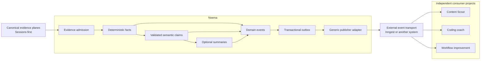

# Architecture

- Status: accepted design baseline
- Date: 2026-07-22
- Updated: 2026-07-28
- Scope: local-first knowledge pipeline and consumer-neutral event boundary

## Executive summary

Noema is a local-first derived-knowledge and event system. It does not repeat
provider capture, parsing, or canonical transcript storage already owned by
Sessions. It consumes canonical evidence, extracts observable facts
deterministically, admits evidence-backed semantic claims, builds optional
summary projections, and records meaningful changes as durable domain events.

Noema core ends at a transactional outbox. A small publisher adapter may hand
an outbox event to an external transport, but Noema does not know which
consumers exist or what they do.

Agents and other reactive services are independent consumers. Inngest,
Cloudflare, Eve channels, or another platform may wake them from published
events and own fan-out, retries, schedules, model execution, run history, and
outputs. Content Scout is one planned consumer. It is not a Noema module.

The first implementation is a standalone Go application with a Noema-owned
SQLite database. Sessions is the first evidence plane. One explicitly selected
session is processed through independently inspectable stages before broader
scans are considered.

## Design influences

Noema draws from two public designs:

- Drew Bredvick's event-driven pattern: build a normalized evidence layer,
  express meaningful changes as events, publish them, and let small focused
  consumers react independently.
- Cerebras's knowledge-base design: meet data where it lives, distill coherent
  source units into a shared shape, retain rich metadata and provenance,
  combine retrieval methods when needed, and restore useful context.

References:

- <https://x.com/dbredvick/status/2077938167567487241>
- <https://x.com/dbredvick/status/2078086524470464577>
- <https://x.com/dbredvick/status/2078108962319217145>
- <https://x.com/dbredvick/status/2078150905078206789>
- <https://www.cerebras.ai/blog/how-we-built-our-knowledge-base>
- <https://www.inngest.com/docs/features/events-triggers>
- <https://eve.dev/docs/agent-config>

These are influences, not specifications. Noema adapts them for private,
personal-scale work and explicit human control.

The X threads supply the source → normalization → event → independent-consumer
sequence. “Ontology” means a shared, small typed model here, not a graph
database. The Cerebras article informs evidence distillation, metadata,
provenance, and retrieval. Sessions already owns the canonical capture and
provider-normalization portion for coding-agent history.

## System context


```mermaid
flowchart LR
    SOURCES["Canonical evidence planes<br/>Sessions first"]

    subgraph NOEMA["Noema"]
        ADMIT["Evidence admission"]
        FACTS["Deterministic facts"]
        CLAIMS["Validated semantic claims"]
        SUMMARIES["Optional summaries"]
        EVENTS["Domain events"]
        OUTBOX["Transactional outbox"]
        PUBLISHER["Generic publisher adapter"]

        ADMIT --> FACTS
        FACTS --> CLAIMS
        CLAIMS --> SUMMARIES
        FACTS --> EVENTS
        CLAIMS --> EVENTS
        SUMMARIES --> EVENTS
        EVENTS --> OUTBOX
        OUTBOX --> PUBLISHER
    end

    TRANSPORT["External event transport<br/>Inngest or another system"]

    subgraph CONSUMERS["Independent consumer projects"]
        CONTENT["Content Scout"]
        COACH["Coding coach"]
        WORKFLOW["Workflow improvement"]
    end

    SOURCES --> ADMIT
    PUBLISHER --> TRANSPORT
    TRANSPORT --> CONTENT
    TRANSPORT --> COACH
    TRANSPORT --> WORKFLOW
```

The heavy line is the product boundary:

```text
derived state + domain event + outbox record commit atomically
==============================================================
Noema core ends
```

The publisher is an infrastructure adapter at the edge. It may record delivery
attempts and acknowledgements for outbox reliability. It must not prepare
consumer-specific inputs, match subscriptions, call an agent, wait for a run,
or admit a consumer result.

## The boundary test

A change belongs in Noema only when it answers one of these questions:

- Which canonical evidence was selected and admitted?
- Which deterministic facts can be derived from it?
- Which semantic claims are supported?
- Which summary projection can be rebuilt from admitted records?
- What meaningful Noema-owned state changed?
- Which event and outbox record describe that change?
- Was that event accepted by the configured transport?

A change belongs outside Noema when it answers one of these questions:

- Which consumer subscribes?
- Which prompt, model, tool, or agent framework should run?
- How should a consumer retry, schedule, or keep memory?
- How should content ideas, coding assessments, or workflow proposals be
  represented?
- Did a consumer finish?
- What did it cost to run?
- Should its result be approved or published?

This test applies to domain types, application ports, database tables,
configuration, commands, and documentation. Consumer-specific logic does not
become acceptable merely because it is hidden behind a generic interface.

## Use-case-neutral knowledge pipeline

The knowledge pipeline describes evidence. It does not optimize evidence for a
particular consumer. Deterministic extractors must not emit content hooks or
learning recommendations. Semantic extraction must not decide that a behavior
is publishable, a workflow should change, or the user has a weakness.

The reusable model is:

```text
EvidenceRevision
        ↓ selected by
AnalysisRun(stage, scope, coverage, configuration)
        ├── Fact
        ├── Claim
        └── SummaryProjection
                 ↓ changed state produces
             DomainEvent
                 ↓ committed with
             OutboxRecord
```

These are domain responsibilities, not a required table-per-type schema.
Content ideas, coding assessments, and workflow proposals are deliberately
absent.

## Core flow

### 1. Select and admit canonical evidence

V0 starts from one explicitly selected canonical Sessions identity. Milestone 1
uses `sessions export '<id>' --format jsonl --full` to read the complete
export-eligible content of the latest retained snapshot locally. The source
reader verifies schema version, `untrusted-history` disposition, identity,
document digest, entry and segment coordinates, omissions, and source coverage.

Full export removes presentation bounds; it does not claim that Sessions
captured unsupported or missing provider content. The local subprocess reader
enforces a 64 MiB ceiling and records an inspectable failure rather than
accepting a partial export or buffering input without a bound.

Canonical content is transient in Noema. The durable source snapshot remains in
Sessions. Noema persists only the evidence coordinates and processing identity
needed to explain and rerun its own derived stages, plus bounded selected fact
values. Explicit evidence resolution is transient and digest-locked.

Later multi-session work becomes inventory-first. One explicit operation reads
a transcript-free `sessions manifest` cohort from a single retained-library
snapshot, records its fixed selection and capture scope, and then hydrates only
the revisions needed by requested processing stages. The single-session path
does not add this extra read.

Every analysis states whether it covers the complete retained snapshot or only
a selected range. Partial analysis is never described as understanding the
whole session.

### 2. Extract deterministic facts

Code extracts what the canonical structure can establish without a model. The
initial scope includes:

- tool calls and results;
- commands;
- test invocations and parsed test summaries;
- directly supported success, failure, or unknown outcomes;
- compiler, package, and tool errors;
- file references;
- package names and URLs;
- repository metadata when directly available; and
- explicit verification assertions.

Each fact records its kind, structured value, extractor and schema versions,
parse rule, and exact evidence references. Deterministic means the same
supported parser produces the same result, not that the result is certain.
Narrative text such as “tests should pass” cannot become a successful test fact.

### 3. Extract semantic candidate claims

A provider-neutral structured-generation boundary interprets bounded canonical
evidence and deterministic facts. The initial vocabulary is:

- problem
- symptom
- hypothesis
- failed attempt
- root cause
- decision
- solution
- verification
- lesson

The model returns candidate claims, never admitted knowledge. Each candidate
states whether it is observed, inferred, or uncertain and includes confidence,
supporting evidence, and contradictory evidence when known.

### 4. Validate and admit claims

Noema validates candidate schema, evidence coordinates, confidence, status,
contradictions, privacy, and consistency with deterministic facts. Coding
evidence generally follows this precedence:

```text
test, compiler, and tool output
        > observed diff or edit
        > assistant statement
        > unsupported human or model assumption
```

This precedence guides validation; it does not make every source record true.
Claims that fail local checks are rejected. Insufficient evidence can produce
an empty successful result. Semantic support quality is measured with reviewed
fixtures and approved local sessions.

### 5. Close the analysis and optionally summarize it

Each processing attempt records an `AnalysisRun`. It identifies the exact
canonical evidence selected, project and time scope when known, coverage and
omissions, admitted fact and claim identities, processing configuration, and
final status.

A summary may present admitted records as a problem, attempts, outcome,
verification, lessons, and unknowns. Every summary statement points to fact or
claim identities. The summary can be discarded and rebuilt without losing
knowledge. Long-session phase summaries may be added later when input or
retrieval limits require them.

### 6. Record a domain event and outbox entry

A meaningful derived-state change produces a small versioned event such as:

```text
fact.observed
claim.admitted
analysis.completed
summary.updated
episode.created
episode.updated
```

The state change, event, and outbox record commit in one SQLite transaction.
This prevents derived state from changing without a durable publication record.
Events describe Noema-owned state and remain independent of any consumer.

The event envelope contains:

- a stable event ID and fingerprint;
- a schema version and event type;
- a subject type and ID;
- a creation time;
- a bounded payload; and
- bounded stable references to Noema-owned records.

It does not contain raw transcript bodies, a prompt, a consumer name, a model
route, or a consumer-specific input.

### 7. Publish generically

A publisher adapter claims or reads a pending outbox entry and gives its event
envelope to one configured transport. On acknowledgement, Noema records the
publication as delivered. On failure, the record remains inspectable and
eligible for an explicit later attempt.

The first implementation is manual and local. A fake publisher proves the
contract, and a JSONL publisher makes the boundary visible before a hosted
transport is chosen. It appends one complete event envelope per explicit
command. The stable event ID is the external deduplication key.

The publisher does not:

- discover or match subscribers;
- create jobs for consumers;
- prepare evidence for one consumer;
- invoke Eve, a model, or an agent;
- wait for downstream completion;
- store consumer runs or receipts; or
- admit downstream output.

## Component ownership

| Component | Owns | Does not own |
| --- | --- | --- |
| Sessions | Provider capture, parsing, structural normalization, canonical retention, revision inventory, transcript retrieval | Semantic claims, Noema storage, consumers |
| Sessions evidence reader | Supported CLI invocation, explicit selection, contract validation, bounded transient input | Provider parsing, Sessions storage, semantic interpretation |
| Fact extractor | Deterministic observations, evidence links, extractor version | Semantic interpretation or source retention |
| Semantic extractor | Candidate claims and model metadata | Admission, canonical evidence, downstream use |
| Claim validator | Schema, evidence, contradiction, privacy, and domain checks | Model reasoning or source mutation |
| Summary builder | Rebuildable views over admitted facts and claims | New evidence or facts |
| Episode builder | Later revisable grouping and confidence | Workflow-specific identity |
| Knowledge store | Analysis runs, facts, claims, summaries, relationships, evidence references | Canonical source content |
| Retrieval service | Bounded Noema-owned knowledge queries | Consumer orchestration |
| Event store | Append-only consumer-neutral domain events and order | Transcript bodies or subscriptions |
| Outbox store | Atomic publication intent and delivery state | Consumer jobs or execution |
| Publisher adapter | Transport encoding, delivery attempt, acknowledgement | Subscribers, agents, prompts, runs, outputs |
| Presentation | Commands and review views | Domain decisions |
| Composition root | Concrete storage, source, publisher, and model wiring | Domain behavior |
| External transport | Delivery, fan-out, subscription triggers, workflow durability | Noema knowledge authority |
| Independent consumer | Its triggers, runtime, prompts, tools, retries, state, output, and review | Direct Noema storage writes |

Dependencies point inward toward domain and application contracts. Only the
composition root knows concrete source, storage, model, and publication
implementations.

## Core concepts

### Evidence revision

A stable identity for one canonical source revision:

- source kind and instance;
- stable native identity;
- source contract schema and trust disposition;
- document digest;
- capture time and source time when known; and
- project, workspace, and other source metadata when known.

For Sessions, the durable document remains in Sessions. Noema stores identity,
digest, processing keys, and exact coordinates rather than an immutable
transcript copy.

### Evidence set

`EvidenceSet` is the future Noema-owned selection record for one explicit
multi-revision operation. It is not needed by the single-session V0 path and
does not justify a port or table until multi-session work begins.

An evidence set records:

- source contract schema and trust disposition;
- normalized cohort filters, fixed order, and maximum bound;
- Sessions `captureScope`;
- ordered canonical identities, document digests, and document counts; and
- per-revision hydration and requested-stage outcomes.

It contains no transcript body, does not pin a Sessions document, and does not
claim that its revisions form one episode.

Four coverage statements remain distinct:

1. Manifest completeness for its query over one retained-library snapshot.
2. Sessions capture scope for applicable provider evidence.
3. Noema hydration outcomes for selected revisions.
4. Per-document analysis coverage.

### Evidence reference

A durable pointer from a Noema record to source evidence:

- evidence revision identity and document digest;
- entry, segment, or other coordinates;
- content hash when available;
- timestamp, actor, origin, and tool relationship when canonical data supplies
  them; and
- a bounded excerpt only when required for review.

An evidence reference is provenance, not proof that the referenced claim is
true.

### Deterministic fact

A mechanically derived observation:

- kind and structured value;
- extractor, parse rule, and schema versions;
- exact evidence references;
- actor, origin, or subject when directly supported;
- time or repository metadata when directly supported; and
- success, failure, or unknown for outcome facts.

Facts require no model, prompt, or confidence score. They remain derived and
rebuildable.

### Semantic claim

A normalized interpretation admitted from untrusted model output:

- claim type;
- statement;
- status: observed, inferred, or uncertain;
- confidence;
- supporting and contradicting evidence;
- optional supporting fact identities;
- subject and scope when supported;
- causal attribution when relevant: user, agent, environment, mixed, or
  unknown; and
- extractor, schema, prompt, model, and route versions.

Facts and claims use separate domain types and validation paths.

### Analysis run

A versioned record of one bounded processing attempt:

- stage: facts, claims, or summary;
- selected evidence revision identities and selection method;
- project, workspace, and time scope when known;
- bounds, omissions, truncation, and available coverage;
- ordered input and output fact and claim identities;
- applicable processor, schema, prompt, model, route, and privacy versions; and
- start and completion times, status, and bounded failure details.

An analysis is a processing boundary, not a claim that one session equals one
work episode.

### Summary projection

An optional versioned view built only from an analysis's admitted facts and
claims:

- problem and context;
- root cause and decisions when supported;
- attempts and outcomes;
- solution, final outcome, and verification;
- reusable lessons;
- unknowns, contradictions, omissions, and coverage limits; and
- supporting fact and claim identities for every section.

Content suitability, personal development, and workflow recommendations are
not summary fields.

### Episode

A later, revisable grouping of related observations:

- Noema-owned identity;
- goal and current state;
- time range;
- project or workspace scope;
- relationships to facts and claims; and
- grouping confidence.

Episodes do not require structured completion or a work item.

### Domain event

A small fact that Noema-owned state changed:

- event ID, fingerprint, type, and schema version;
- subject type and identity;
- creation time;
- bounded payload; and
- ordered Noema record references.

Events do not name consumers and do not contain raw evidence.

### Outbox record

The durable publication intent for one domain event:

- event ID;
- publication status;
- attempt count;
- last bounded failure category;
- delivered time; and
- transport acknowledgement ID when available and safe to retain.

An outbox record says nothing about subscriber delivery or consumer execution.
One event has one outbox record in V0. Its stable event ID lets a transport or
consumer deduplicate a repeated delivery.

## Initial persistence

SQLite is the first durable derived store. The target Noema-owned projections
are:

```text
analysis_runs
facts
semantic_analysis_details
claims
events
event_outbox
```

Optional later projections appear only when needed:

```text
summaries
evidence_sets
episodes
knowledge_units
```

The event-boundary cutover removed the pre-V1 scans, observations, jobs, agent
runs, and content ideas. Those tables proved process and transaction mechanics;
they were never accepted product contracts. Noema rejects that old schema
rather than adding compatibility readers, backfills, dual writes, or
mixed-schema behavior. Pre-V1 local databases must be recreated.

Each rerunnable stage has a separate identity:

- Evidence admission: Sessions identity plus canonical digest and coordinates.
- Facts: admitted evidence identity plus deterministic extractor version.
- Claims: admitted evidence and facts plus semantic schema, prompt, model, and
  route configuration.
- Summary: ordered fact and claim identities plus summary configuration.
- Event: schema, type, subject, bounded payload, and ordered record references.
- Publication: event ID.

Consumer prompts, models, retries, runs, and outputs do not participate in a
Noema processing key.

## Sessions boundary

Sessions is the external, local, revision-identified evidence plane for
coding-agent history. A revision is verified by canonical identity plus
document digest; it is not directly addressable by digest and a manifest does
not pin its body.

Noema:

- requires the user to index Sessions explicitly;
- uses versioned JSON or JSONL commands;
- validates schema and trust disposition;
- starts from one explicit canonical session identity;
- later selects one atomic transcript-free cohort with `sessions manifest`;
- accepts hydrated content only when identity and digest match the selection;
- fails a mismatched or unavailable revision closed;
- uses exact entry and segment coordinates;
- records omissions, bounds, capture scope, and analysis coverage honestly;
- treats transcript instructions as untrusted history; and
- resolves evidence only against the recorded digest.

Noema does not import Sessions modules, read its SQLite database, parse provider
storage, duplicate complete transcripts, or treat source roots as episodes.

When a revision is unavailable, existing facts, claims, summaries, and events
remain inspectable from stored lineage. They are not rerunnable or resolvable
to canonical content until that exact revision becomes available again.

## Event and publication semantics

The local event store and outbox establish the behavior any later transport
must preserve:

- Events are append-only and versioned.
- A state change, event, and outbox record become visible atomically.
- Events are consumer-neutral.
- An acknowledged and committed outbox record is not published again.
- A failed transport attempt never changes the underlying event.
- Bounded transport failures remain inspectable without response bodies or
  secrets.
- Publication is at least once, not exactly once. A crash or timeout after the
  transport accepted an event but before Noema committed the acknowledgement
  can cause a later duplicate delivery.
- Every repeated delivery carries the same event ID so the transport and
  consumers can deduplicate it.
- Replaying or republishing an event grants no new external authority.
- Delivery means the configured transport acknowledged the event. It does not
  mean any consumer received, ran, succeeded, or produced useful output.

V0 uses an explicit one-shot publication command. It does not add a daemon,
scheduler, leases, automatic retries, or hosted queue. Those mechanics move to
an external transport when the manual boundary proves useful.

Possible transport adapters include JSONL, HTTP ingestion, Inngest events, or
Cloudflare Queues. The adapter surface sends one event envelope and receives a
bounded acknowledgement. It does not expose subscriptions or execution.

## Retrieval architecture

Noema follows a staged retrieval path:

1. Structured relationships and metadata.
2. Full-text search over normalized knowledge.
3. Embedding similarity when real queries show a semantic gap.
4. Fusion, deduplication, reranking, and context expansion when multiple
   retrievers exist.

Every retriever returns a shared evidence-result shape. External consumers use
a future bounded read interface rather than SQLite or Sessions internals.

Facets come from meaningful metadata, not speculative columns. Initial facets
may include time range, project or workspace, fact or claim kind, source kind,
confidence, coverage, and event type.

## Model gateway

Noema owns a small structured-generation interface for its semantic extraction
stages. Extractors call it using a task-level model alias, instructions,
bounded input, and output schema. They do not import a provider SDK, use a
provider model name, or interpret a provider response directly.

The first adapter uses Vercel AI Gateway through its OpenAI-compatible Chat
Completions API. Vercel is an initial transport and routing choice, not a
domain concept.

The implemented V0 route is
[`config/semantic-route.example.json`](../config/semantic-route.example.json).
Its `semantic-v1` profile pins:

- Vercel AI Gateway;
- `openai/gpt-oss-120b` through Cerebras;
- strict JSON Schema output;
- numeric temperature zero;
- 60-second timeout;
- 4,096 output tokens;
- zero retries; and
- explicit zero-retention and no-training choices, currently both disabled for
  the Hobby-plan experiment.

Temperature zero reduces sampling variation but does not guarantee identical
output. Privacy requests constrain routing but are not local proof of provider
behavior. Unknown fields, changed routing, extra providers, and changed
sampling or execution limits are rejected before adapter construction.

Remote semantic execution is opt-in. The manual command requires
`--allow-remote`, the explicit route file, and `AI_GATEWAY_API_KEY`. Without an
explicit range, the complete retained snapshot must fit every input budget.
With a paired entry range, the analysis records partial coverage. Source
identity and transcript storage do not cross the model boundary.

The `gateway check` command sends fixed public synthetic input through the
production prompt, schema, route loader, and Gateway adapter. It does not read
Sessions, open Noema's database, or admit claims.

The developer-only semantic evaluator runs immutable, digest-pinned synthetic
corpora through the production preparation and admission path. It does not
read Sessions, publish product events, or persist product analysis. Human
sidecars judge evidence support and usefulness.

The reviewed V2 run completed all 20 requests. Eighteen batches passed local
admission. Human review judged all 20 admitted claims supported and 19 useful.
The result closed the second-verifier checkpoint while preserving known
conservative misses for root cause, decisions, lessons, and one implemented
change.

The Gateway adapter rejects redirects, oversized bodies, missing or rewritten
model metadata, malformed usage or cost, non-terminal completions, refusals,
tool calls, and output outside the local schema. It maps failures to fixed safe
categories and does not retain provider messages, response bodies, credentials,
or rejected model prose.

Consumer model calls are outside Noema. Content Scout may use Eve and Vercel AI
Gateway, but its route, service tier, tools, usage, and receipts live with that
consumer.

## Independent consumers

### Content Scout

Content Scout is the first planned proof that Noema's knowledge and events are
useful. It is a separate project or deployable consumer.

It may:

- subscribe to `analysis.completed` or more granular event types;
- retrieve bounded admitted facts and claims through a public Noema interface;
- use Eve, AI SDK, or another runtime;
- request Vercel's Flex tier for non-critical work;
- produce zero to five content ideas;
- store its own configuration, executions, ideas, and review decisions; and
- require human review before publication.

Noema does not know that Content Scout exists. Its events remain unchanged if
Content Scout changes model, prompt, schema, platform, or disappears.

### Coding coach

A later coding coach can consume bounded multi-session knowledge and propose
development areas. It must preserve supporting and contradicting evidence,
distinguish user, agent, environment, mixed, and unknown attribution, and avoid
turning a single failure into a personal weakness.

Its assessments, exercises, scores, and review state belong to the consumer.
If an approved assessment should become Noema evidence, it re-enters through a
normal source adapter.

### Workflow improvement

A later workflow consumer can look for repeated friction, corrections, failed
approaches, or verification gaps and propose changes to skills, instructions,
tools, configuration, or tests. It owns those proposals and never applies them
without explicit authority.

## Delivery sequence

Noema's first complete path has three milestones:

1. **Canonical evidence and deterministic facts.** Process one explicit
   Sessions identity, validate canonical export, and store inspectable facts
   with exact evidence coordinates without a model call.
2. **Semantic claims.** Add privacy-filtered structured generation, validate
   untrusted candidate claims against evidence and stronger facts, and persist
   admitted claims and consumer-neutral events.
3. **Durable event publication.** Add the transactional outbox, local
   inspection, and one generic manual publisher. Prove exact unchanged reruns
   and repeated delivery attempts do not duplicate events.

Content Scout then becomes the first downstream integration test, not a fourth
Noema runtime layer.

## Growth path

After the event boundary is useful:

1. Build Content Scout independently against published events.
2. Record content feedback in the consumer.
3. Add deterministic incremental windows for growing sessions.
4. Add manifest-backed multi-session evidence sets.
5. Build the coding coach independently.
6. Add a second source when missing evidence limits quality.
7. Add structured and full-text retrieval, then embeddings only if needed.
8. Add a hosted event transport when manual publication is limiting.

Possible later mappings:

| Need | Possible implementation |
| --- | --- |
| Event delivery and reactive workflows | Inngest or Cloudflare Queues |
| Focused model and tool execution | Eve, AI SDK, local executable, or another runtime |
| Consumer retries, scheduling, and approvals | Inngest, Eve, or Cloudflare Workflows |
| Remote relational projections | Cloudflare D1 |
| Semantic retrieval | Local vector index or Cloudflare Vectorize |
| Large derived artifacts | Local files or Cloudflare R2 |

These are options, not commitments. Raw private evidence does not move to
remote infrastructure without a separate privacy design.

## Accepted decisions

- Noema is separate from Harness, Sessions, workflow engines, and consumers.
- Sessions remains the canonical coding-session evidence plane.
- Noema consumes Sessions only through its public CLI and does not duplicate
  canonical transcript storage or provider parsing.
- Go and SQLite are the first implementation stack.
- One explicit canonical Sessions identity is processed before ambient scans.
- Later multi-session operations use transcript-free manifest cohorts and
  preserve capture, hydration, and analysis coverage separately.
- Initial fact and claim processing remains per revision.
- Deterministic facts precede semantic extraction.
- Facts and claims remain separate authority classes and validation paths.
- Evidence resolves only against its recorded Sessions document digest.
- Every processing attempt records a versioned `AnalysisRun`.
- Summaries are optional projections, never source evidence or the only stored
  knowledge.
- Evidence admission, facts, claims, summaries, and events are
  use-case-neutral.
- Work episodes are inferred Noema records, not workflow work items.
- Noema core ends at the domain-event and transactional-outbox boundary.
- The event publisher is generic and knows no consumer.
- Noema owns no subscriptions, consumer jobs, worker queue, dispatcher,
  execution runs, receipts, or consumer artifacts.
- Consumer code never writes Noema stores directly.
- Consumer results re-enter only through a normal source/evidence boundary.
- The pre-V1 agent scaffold was removed and has no compatibility path.
- Structured and full-text retrieval come before embeddings.
- The first interface is a CLI.
- Vercel AI Gateway is the initial semantic model-gateway adapter.
- The initial gateway transport is OpenAI-compatible Chat Completions.
- Models and providers are selected through explicit routes.
- Remote semantic processing is opt-in and output is validated locally.
- Content Scout, coding coaching, and workflow improvement are independent
  consumers, not Noema modules.

## Rejected alternatives

### Noema-owned agent runtime

Rejected: matching domain events to agent subscriptions, creating agent jobs,
claiming them in a Go worker, invoking Eve, admitting results, and storing
agent artifacts in Noema.

Why:

- It couples the knowledge system to current consumers.
- It makes Noema own execution concerns already handled by workflow platforms.
- A “generic” dispatcher still requires consumer configuration, lifecycle, and
  output concepts in the core.
- It prevents consumers from evolving or deploying independently.
- It confuses event publication with downstream completion.

### SQLite as a general agent queue

Rejected. SQLite remains Noema's local knowledge and outbox store. It is not a
replacement for Inngest, Cloudflare Queues, or another workflow engine.

### Direct Noema-to-Eve calls

Rejected. Eve can react through its own channel or an external workflow. Noema
does not call, authenticate, inspect, or version Eve.

### Privileged consumer result callback

Rejected. A consumer result is not automatically Noema knowledge. Approved
results re-enter through normal evidence ingestion.

These rejections are active architecture constraints, not deferred V0 choices.

## Deferred decisions

- Exact event and outbox schemas for the V1 cutover.
- Whether the first visible publisher writes JSONL or sends an HTTP event.
- Which hosted event transport follows the local proof.
- Whether a later need justifies more than one publisher route.
- The bounded public read interface for external consumers.
- Post-V1 schema evolution.
- Whether real claims justify knowledge units.
- Whether long sessions justify summary projections.
- How later retrieval combines full text, embeddings, and context expansion.
